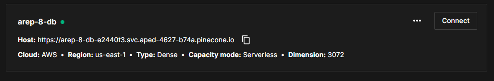

### Escuela Colombiana de Ingeniería

### Arquitectura Empresarial - AREP

# Build a Retrieval Augmented Generation (RAG)
One of the most powerful applications enabled by LLMs is sophisticated question-answering (Q&A) chatbots. These are applications that can answer questions about specific source information. These applications use a technique known as Retrieval Augmented Generation, or RAG.

## Pinecon 
Pinecone is a vector database with broad functionality.
## Setup

To use the `PineconeVectorStore`, you first need to install the partner package, as well as the other packages used throughout this notebook.

```sh
pip install -qU langchain-pinecone pinecone-notebooks
```

## Credentials

Create a new Pinecone account, or sign into your existing one, and create an API key to use in this notebook.

```python
import getpass
import os
from pinecone import Pinecone, ServerlessSpec

if not os.getenv("PINECONE_API_KEY"):
    os.environ["PINECONE_API_KEY"] = getpass.getpass("Enter your Pinecone API key: ")

pinecone_api_key = os.environ.get("PINECONE_API_KEY")
pc = Pinecone(api_key=pinecone_api_key)
```

---

## Initialization

Before initializing our vector store, let's connect to a Pinecone index. If one named `index_name` doesn't exist, it will be created.

```python
import time

index_name = "langchain-test-index"  # change if desired

existing_indexes = [index_info["name"] for index_info in pc.list_indexes()]

if index_name not in existing_indexes:
    pc.create_index(
        name=index_name,
        dimension=3072,
        metric="cosine",
        spec=ServerlessSpec(cloud="aws", region="us-east-1"),
    )
    while not pc.describe_index(index_name).status["ready"]:
        time.sleep(1)

index = pc.Index(index_name)
```



Now that our Pinecone index is set up, we can initialize our vector store.

```python
from langchain_openai import OpenAIEmbeddings
from langchain_pinecone import PineconeVectorStore

embeddings = OpenAIEmbeddings(model="text-embedding-3-large")
vector_store = PineconeVectorStore(index=index, embedding=embeddings)
```

---

## Manage Vector Store

Once you have created your vector store, you can interact with it by adding and deleting different items.

### Add Items to Vector Store

We can add items to our vector store by using the `add_documents` function.

```python
from uuid import uuid4
from langchain_core.documents import Document

documents = [
    Document(page_content="I had chocolate chip pancakes and scrambled eggs for breakfast this morning.", metadata={"source": "tweet"}),
    Document(page_content="The weather forecast for tomorrow is cloudy and overcast, with a high of 62 degrees.", metadata={"source": "news"}),
    Document(page_content="Building an exciting new project with LangChain - come check it out!", metadata={"source": "tweet"}),
    Document(page_content="Robbers broke into the city bank and stole $1 million in cash.", metadata={"source": "news"}),
    Document(page_content="Wow! That was an amazing movie. I can't wait to see it again.", metadata={"source": "tweet"}),
    Document(page_content="Is the new iPhone worth the price? Read this review to find out.", metadata={"source": "website"}),
    Document(page_content="The top 10 soccer players in the world right now.", metadata={"source": "website"}),
    Document(page_content="LangGraph is the best framework for building stateful, agentic applications!", metadata={"source": "tweet"}),
    Document(page_content="The stock market is down 500 points today due to fears of a recession.", metadata={"source": "news"}),
    Document(page_content="I have a bad feeling I am going to get deleted :(", metadata={"source": "tweet"}),
]

uuids = [str(uuid4()) for _ in range(len(documents))]
vector_store.add_documents(documents=documents, ids=uuids)
```

### Delete Items from Vector Store

```python
vector_store.delete(ids=[uuids[-1]])
```

---

## Query Vector Store

Once your vector store has been created and the relevant documents have been added, you will most likely wish to query it during the running of your chain or agent.

### Query Directly

Performing a simple similarity search can be done as follows:

```python
results = vector_store.similarity_search(
    "LangChain provides abstractions to make working with LLMs easy",
    k=2,
    filter={"source": "tweet"},
)
for res in results:
    print(f"* {res.page_content} [{res.metadata}]")
```

**Example Output:**

```
* Building an exciting new project with LangChain - come check it out! [{'source': 'tweet'}]
* LangGraph is the best framework for building stateful, agentic applications! [{'source': 'tweet'}]
```

### Similarity Search with Score

```python
results = vector_store.similarity_search_with_score(
    "Will it be hot tomorrow?", k=1, filter={"source": "news"}
)
for res, score in results:
    print(f"* [SIM={score:3f}] {res.page_content} [{res.metadata}]")
```

**Example Output:**

```
* [SIM=0.553187] The weather forecast for tomorrow is cloudy and overcast, with a high of 62 degrees. [{'source': 'news'}]
```

---

## Other Search Methods

There are more search methods (such as MMR) not listed in this notebook. To find all of them, be sure to read the API reference.

### Query by Turning into Retriever

You can also transform the vector store into a retriever for easier usage in your chains.

```python
retriever = vector_store.as_retriever(
    search_type="similarity_score_threshold",
    search_kwargs={"k": 1, "score_threshold": 0.5},
)
retriever.invoke("Stealing from the bank is a crime", filter={"source": "news"})
```

**Example Output:**

```
[Document(metadata={'source': 'news'}, page_content='Robbers broke into the city bank and stole $1 million in cash.')]
```

---

## Usage for Retrieval-Augmented Generation (RAG)

For guides on how to use this vector store for retrieval-augmented generation (RAG), see the following sections:

- **Tutorials**
- **How-to: Question and answer with RAG**
- **Retrieval conceptual docs**
- **API reference**: [PineconeVectorStore Documentation](https://python.langchain.com/api_reference/pinecone/vectorstores/langchain_pinecone.vectorstores.PineconeVectorStore.html)


